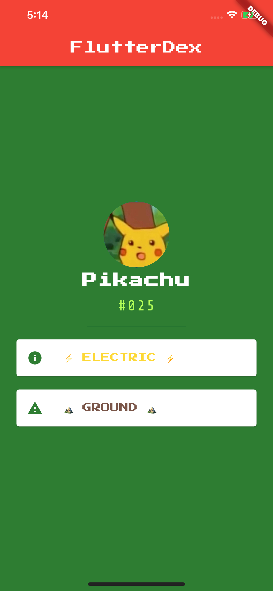

# FlutterDex

A small App in the journey of learning `Flutter/Dart` showing a simple entry for the Pokemon Pikachu using two Card() elements.

## Learning objectives:

- Creating Stateless Widgets
- Difference between hot reload, hot refresh and running an app from cold
- Using Containers to lay out the UI
- Using Columns and Rows to position UI elements
- Adding custom fonts
- Adding Material icons
- Styling Text widgets
